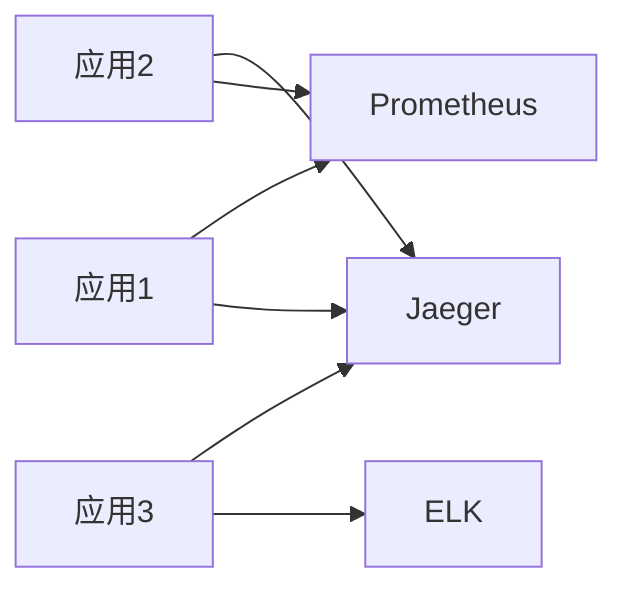
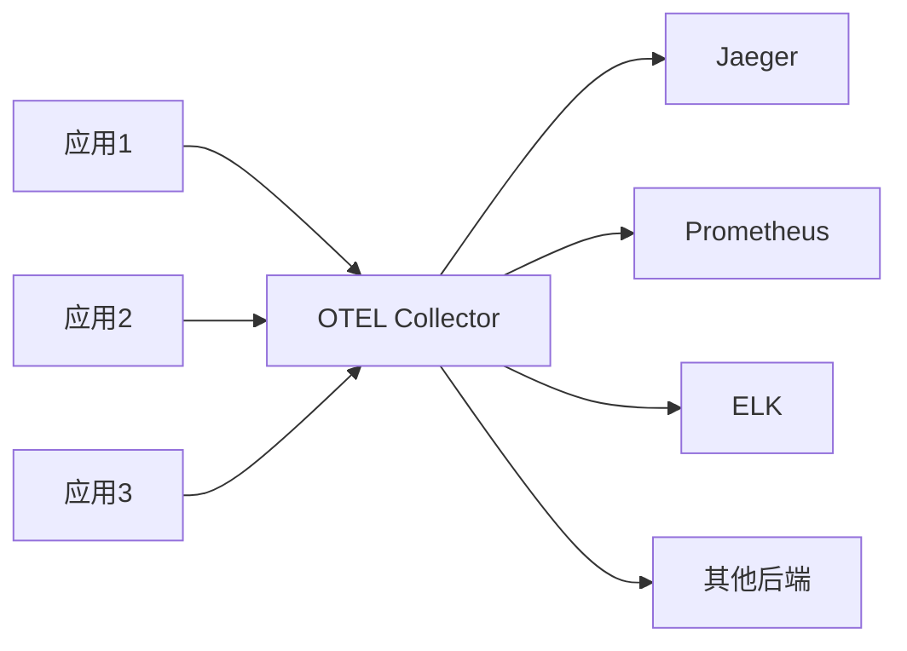
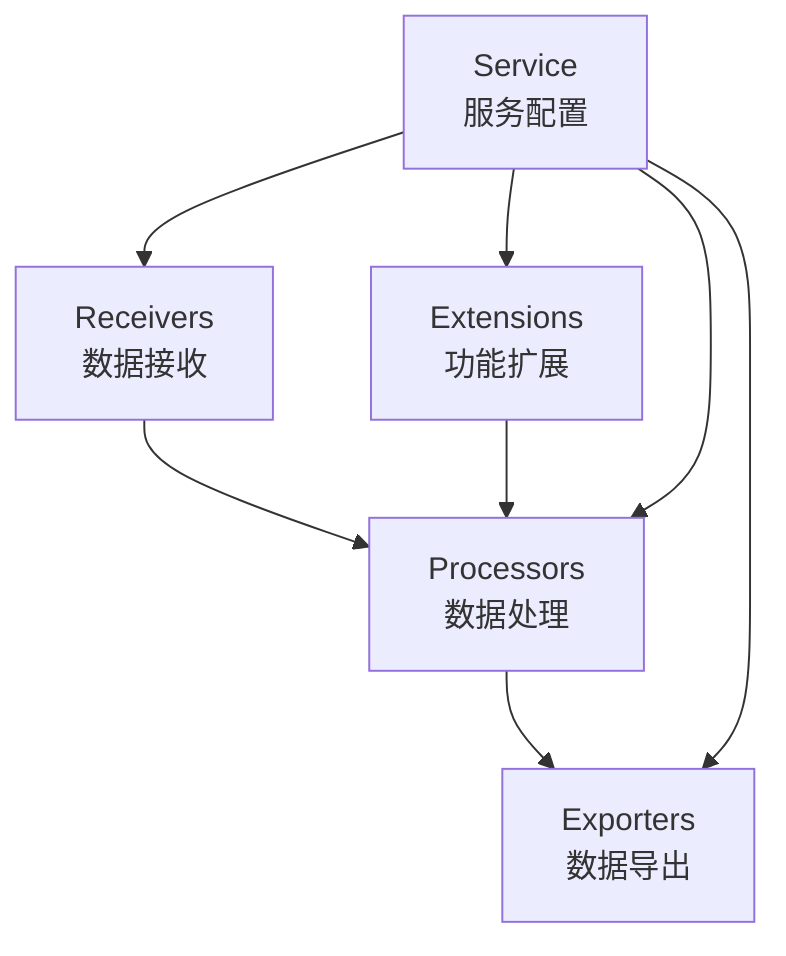
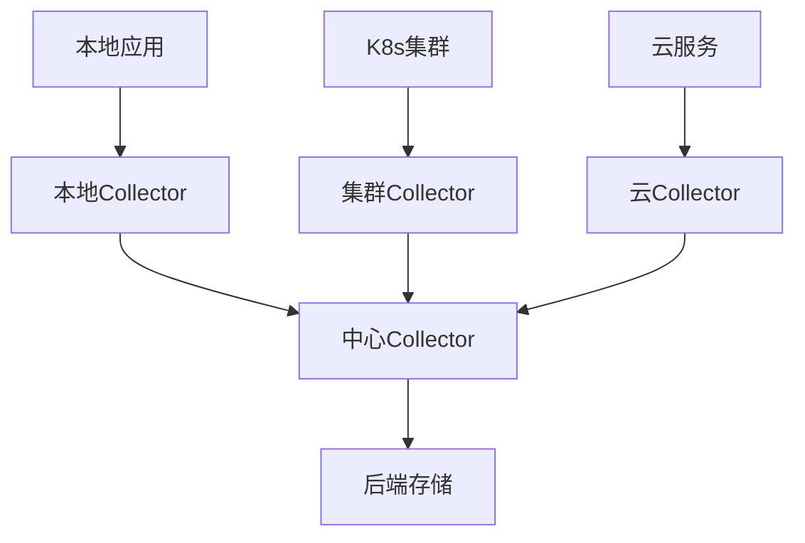
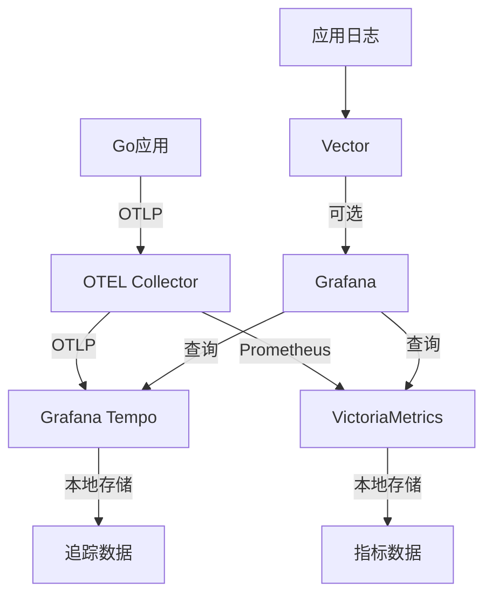

# OpenTelemetry Collector 使用指南

## 📖 目录

- [什么是 OpenTelemetry Collector](#什么是-opentelemetry-collector)
- [为什么需要 Collector](#为什么需要-collector)
- [架构设计](#架构设计)
- [快速开始](#快速开始)
- [配置详解](#配置详解)
- [使用场景](#使用场景)
- [常见问题](#常见问题)
- [进阶配置](#进阶配置)

## 什么是 OpenTelemetry Collector

OpenTelemetry Collector（简称 OTEL Collector）是一个**可观测性数据管道**，用于接收、处理和导出遥测数据（追踪、指标、日志）。它是云原生计算基金会（CNCF）的开源项目。

### 🎯 核心价值

1. **统一数据收集**：将不同格式、不同来源的遥测数据统一处理
2. **数据增强**：在数据导出前进行过滤、转换、聚合
3. **解耦应用与后端**：应用只需对接 Collector，后端存储可灵活切换
4. **降低资源消耗**：减少直接连接后端的应用数量

## 为什么需要 Collector

### 传统方式的痛点



**问题**：

- 每个应用需要配置多个后端
- 网络连接复杂
- 格式不统一
- 难以管理和维护

### 使用 Collector 后



**优势**：

- 应用只需对接一个 Collector
- 统一的数据格式（OTLP）
- 灵活的数据处理
- 简化运维管理

## 架构设计

### 核心组件



#### 1. Receivers（接收器）

负责接收遥测数据，支持多种协议：

| 类型 | 协议 | 端口 | 用途 |
|------|------|------|------|
| OTLP | gRPC | 4327 | 高性能二进制协议 |
| OTLP | HTTP | 4328 | RESTful API |
| Jaeger | gRPC/HTTP | 多种 | 兼容 Jaeger |
| Prometheus | HTTP | 多种 | 拉取指标 |
| Zipkin | HTTP | 多种 | 兼容 Zipkin |

#### 2. Processors（处理器）

对接收的数据进行处理：

| 处理器 | 功能 | 使用场景 |
|--------|------|----------|
| `batch` | 批量处理 | 减少网络请求，提高性能 |
| `memory_limiter` | 内存限制 | 防止 OOM |
| `resource` | 资源属性添加 | 添加环境、版本等信息 |
| `filter` | 数据过滤 | 过滤不需要的数据 |
| `attributes` | 属性操作 | 添加、删除、修改属性 |

#### 3. Exporters（导出器）

将处理后的数据发送到后端：

| 导出器 | 后端 | 用途 |
|--------|------|------|
| `logging` | 控制台/文件 | 开发调试 |
| `otlp` | 其他 OTEL 系统 | 级联部署 |
| `jaeger` | Jaeger | 分布式追踪 |
| `prometheus` | Prometheus | 指标存储 |
| `elasticsearch` | Elasticsearch | 日志存储 |

#### 4. Extensions（扩展）

提供额外功能：

| 扩展 | 功能 |
|------|------|
| `health_check` | 健康检查 |
| `pprof` | 性能分析 |
| `zpages` | 调试页面 |

## 快速开始

### 1. 启动 Collector

```bash
# 启动依赖服务（PostgreSQL, Redis, OTEL Collector）
docker compose -f docker-compose.env.yml up -d
```

### 2. 验证 Collector 运行状态

```bash
# 检查容器状态
docker ps | grep otel

# 检查健康状态
curl http://localhost:13133

# 查看日志
docker logs miniblog-otel-collector -f
```

### 3. 启动应用并发送遥测数据

```bash
# 构建并启动应用
make build BINS=blog-apiserver
_output/platforms/$(go env GOOS)/$(go env GOARCH)/blog-apiserver --config configs/blog-apiserver.yaml
```

### 4. 观察遥测数据

启动应用后，你应该能在 Collector 的日志中看到遥测数据：

```bash
# 查看 Collector 日志
docker logs miniblog-otel-collector -f | grep "Trace"
```

## 配置详解

### 当前配置分析

```yaml
# otel-collector.yaml
receivers:
  otlp:
    protocols:
      grpc:
        endpoint: 0.0.0.0:4327  # gRPC 接收端口
      http:
        endpoint: 0.0.0.0:4328  # HTTP 接收端口

processors:
  batch:
    # 批量处理配置，默认：
    # timeout: 200ms
    # send_batch_size: 8192

exporters:
  logging:
    loglevel: info  # 输出到日志，仅用于开发调试

extensions:
  health_check:
    # 健康检查配置，默认在 :13133

service:
  extensions: [ health_check ]  # 启用健康检查扩展
  pipelines:
    traces:   # 追踪数据管道
      receivers: [ otlp ]
      processors: [ batch ]
      exporters: [ logging ]
    metrics:  # 指标数据管道
      receivers: [ otlp ]
      processors: [ batch ]
      exporters: [ logging ]
    logs:     # 日志数据管道
      receivers: [ otlp ]
      processors: [ batch ]
      exporters: [ logging ]
```

### 应用配置对应

在你的 `configs/blog-apiserver.yaml` 中：

```yaml
otel:
  endpoint: 127.0.0.1:4327  # 对应 Collector 的 gRPC 端口
  service-name: blog-apiserver
```

## 使用场景

### 1. 开发调试场景（当前配置）

**特点**：

- 数据输出到日志，便于查看
- 配置简单，快速上手
- 适合开发环境和测试

**用途**：

- 验证遥测数据是否正常生成
- 调试数据格式和内容
- 性能测试和优化

### 2. 生产环境场景

**推荐的完整配置**：

```yaml
receivers:
  otlp:
    protocols:
      grpc:
        endpoint: 0.0.0.0:4327
      http:
        endpoint: 0.0.0.0:4328

processors:
  batch:
    timeout: 200ms
    send_batch_size: 8192
  memory_limiter:
    limit_mib: 512
  resource:
    attributes:
      - key: environment
        value: production
        action: upsert

exporters:
  otlp/jaeger:
    endpoint: jaeger:4317
  prometheus:
    endpoint: "0.0.0.0:8889"
  elasticsearch:
    endpoints: ["http://elasticsearch:9200"]
```

### 3. 混合云场景

Collector 可以部署在不同环境中，实现数据的统一收集：



## 常见问题

### Q1: Collector 没有收到数据？

**排查步骤**：

1. 检查应用配置

```bash
# 确保应用配置正确
grep -n "otel" configs/blog-apiserver.yaml
```

2. 检查网络连通性

```bash
# 测试 gRPC 端口
nc -z localhost 4327
```

3. 检查 Collector 日志

```bash
docker logs miniblog-otel-collector -f
```

### Q2: 数据量太大怎么办？

**解决方案**：

1. 启用采样

```yaml
# 应用端配置
otel:
  sampler:
    type: probabilistic
    param: 0.1  # 10% 采样率
```

2. 调整批处理参数

```yaml
processors:
  batch:
    timeout: 1s
    send_batch_size: 10240
```

### Q3: 如何添加自定义属性？

**方法 1：在 Collector 中添加**

```yaml
processors:
  resource:
    attributes:
      - key: service.version
        value: "1.0.0"
        action: upsert
```

**方法 2：在应用代码中添加**

```go
// 在应用启动时添加资源属性
otel.SetTextMapPropagator(propagation.TraceContext{})
```

## 进阶配置

### 1. 添加数据过滤

```yaml
processors:
  filter:
    traces:
      # 过滤健康检查的追踪
      name:
        unmatched: exclude
        regex: "^/healthz.*"
    metrics:
      # 只包含特定指标
      name:
        include: match_any
        regex: "^http_.*|^user_.*"
```

### 2. 数据转换

```yaml
processors:
  attributes:
    actions:
      - key: "http.method"
        action: extract
        regex: "^/api/(.*)$"
        new_attribute: "api.operation"
```

### 3. 多环境配置

创建 `otel-collector.prod.yaml`：

```yaml
receivers:
  otlp:
    protocols:
      grpc:
        endpoint: 0.0.0.0:4327

processors:
  batch:
  memory_limiter:
    limit_mib: 1024

exporters:
  # 生产环境后端
  otlp/jaeger:
    endpoint: jaeger.production:4317
    tls:
      insecure: false
      cert_file: /certs/client.crt
      key_file: /certs/client.key
  prometheus:
    endpoint: "0.0.0.0:8889"
    namespace: "blog"

service:
  pipelines:
    traces:
      receivers: [ otlp ]
      processors: [ memory_limiter, batch ]
      exporters: [ otlp/jaeger ]
    metrics:
      receivers: [ otlp ]
      processors: [ memory_limiter, batch ]
      exporters: [ prometheus ]
```

### 4. 监控 Collector 自身

```yaml
service:
  extensions: [ health_check, pprof ]
  telemetry:
    logs:
      level: "info"
    metrics:
      address: 0.0.0.0:8888
```

## 性能优化建议

### 1. 资源配置

```yaml
# Docker Compose 中配置资源限制
otel-collector:
  deploy:
    resources:
      limits:
        cpus: '1.0'
        memory: 1G
      reservations:
        cpus: '0.5'
        memory: 512M
```

### 2. 批处理优化

```yaml
processors:
  batch:
    timeout: 200ms      # 平衡延迟和吞吐量
    send_batch_size: 8192  # 根据网络带宽调整
    send_batch_max_size: 16384
```

### 3. 内存管理

```yaml
processors:
  memory_limiter:
    limit_mib: 512     # 根据可用内存调整
    spike_limit_mib: 128
    check_interval: 5s
```

## 架构升级：现代化可观测性栈

MiniBlog v4 已经升级到现代化的可观测性架构：

### 新技术栈

| 组件 | 技术选型 | 优势 |
|------|----------|------|
| **追踪存储** | Grafana Tempo | 轻量级、无需对象存储、原生 Grafana 集成 |
| **指标存储** | VictoriaMetrics | 高性能、低资源消耗、兼容 Prometheus API |
| **可视化** | Grafana | 统一界面、强大的查询和仪表板能力 |
| **数据管道** | OpenTelemetry Collector | 统一数据入口、强大的处理能力 |

### 快速开始

```bash
# 启动可观测性平台
make observability.start

# 构建并启动应用
make build BINS=blog-apiserver
./_output/platforms/$(go env GOOS)/$(go env GOARCH)/blog-apiserver \
  --config configs/blog-apiserver.yaml

# 访问界面
# Grafana: http://localhost:3000 (admin/admin123)
# VictoriaMetrics: http://localhost:8428
# Tempo: http://localhost:3200
```

### 架构图



### 新架构特性

#### 1. Grafana Tempo - 分布式追踪

- **本地存储**：无需配置对象存储
- **高性能**：优化的存储格式
- **原生集成**：与 Grafana 无缝集成
- **兼容性**：支持 Jaeger、OTLP 协议

#### 2. VictoriaMetrics - 指标存储

- **高性能**：比 Prometheus 资源消耗更低
- **数据压缩**：高效的数据压缩算法
- **兼容性**：完全兼容 Prometheus API
- **易扩展**：支持水平扩展

#### 3. 统一的可视化

- **一站式界面**：所有数据在 Grafana 中查看
- **关联分析**：追踪、指标、日志相互关联
- **丰富的仪表板**：预置的监控仪表板

## 配置迁移指南

### 从旧配置迁移

如果你之前使用的是基础的 OTEL Collector 配置，迁移步骤：

1. **备份现有配置**

```bash
cp otel-collector.yaml configs/otel-collector.backup.yaml
```

2. **更新应用配置**
新的配置格式支持更多选项，参考 [`configs/blog-apiserver.yaml`](../configs/blog-apiserver.yaml)

3. **启动新栈**

```bash
make observability.start
```

### 配置文件说明

- [`docker-compose.observability.yml`](../docker-compose.observability.yml) - 完整的可观测性服务
- [`configs/otel-collector.yaml`](../configs/otel-collector.yaml) - Collector 配置
- [`configs/tempo.yaml`](../configs/tempo.yaml) - Tempo 配置
- [`configs/grafana/datasources/`](../configs/grafana/datasources/) - Grafana 数据源配置

## 监控最佳实践

### 1. 追踪监控

```go
// 在代码中添加自定义追踪
tracer := otel.Tracer("blog-apiserver")
ctx, span := tracer.Start(ctx, "user-login")
defer span.End()

// 设置属性
span.SetAttributes(
    attribute.String("user.id", userID),
    attribute.String("user.ip", clientIP),
)

// 记录事件
span.AddEvent("authentication-success",
    trace.WithAttributes(attribute.Bool("success", true)))
```

### 2. 指标监控

```go
// 创建自定义指标
counter := otel.Meter("blog-apiserver").
    NewInt64Counter("user_login_total")
```

### 3. 日志结构化

```yaml
# 使用 JSON 格式日志
log:
  format: json
  level: info
  add-source: true
```

## 故障排查

### 常见问题

1. **Collector 没有收到数据**

```bash
# 检查服务状态
docker compose -f docker-compose.observability.yml ps

# 查看日志
make observability.logs
```

2. **Tempo 没有追踪数据**

- 检查采样率配置
- 确认应用正确发送追踪数据
- 验证 Collector 到 Tempo 的连接

3. **VictoriaMetrics 指标缺失**

- 检查 Prometheus 导出器配置
- 验证指标路径是否正确
- 确认时间范围设置

### 性能优化

1. **采样策略**：生产环境使用 10% 采样率
2. **批处理大小**：根据流量调整批处理参数
3. **资源限制**：合理设置内存和 CPU 限制

## 总结

新的可观测性架构为 MiniBlog v4 提供了：

1. **现代化的技术栈**：Tempo + VictoriaMetrics + Grafana
2. **高性能存储**：优化的数据存储和查询
3. **统一的体验**：一站式可观测性平台
4. **易于扩展**：支持水平扩展和多租户

这套架构为你的微服务应用提供了完整的可观测性能力，帮助你更好地理解系统行为、快速定位问题。

## 下一步建议

1. **立即体验**：`make observability.start`
2. **学习 Grafana**：创建自定义仪表板
3. **深入追踪**：添加分布式追踪到关键业务流程
4. **告警设置**：配置基于指标的告警规则
5. **生产部署**：为生产环境调整配置参数

---

> 💡 **提示**：新架构配置文件已就绪，你可以直接使用 `make observability.start` 启动完整的可观测性平台！
